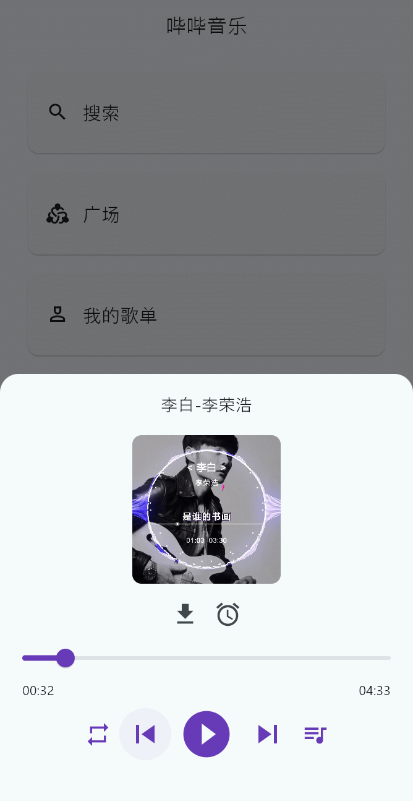
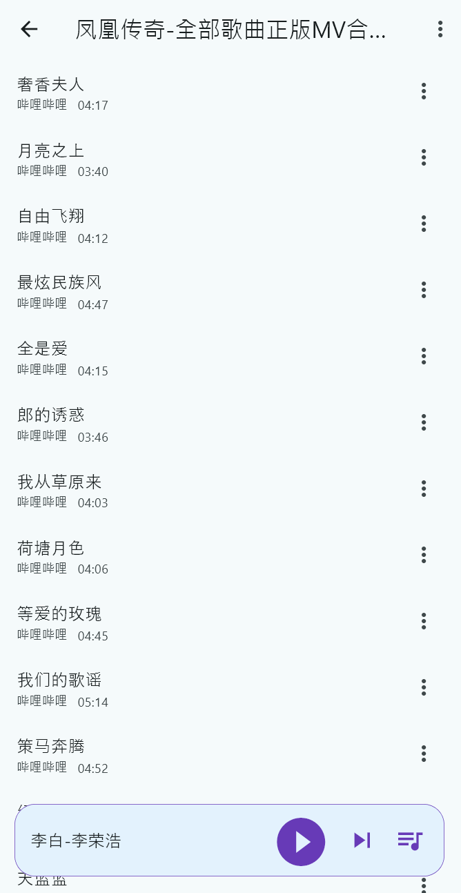

# 哔哔音乐

使用 B 站作为歌曲源开发的音乐播放器

## 实现思路

1. B 站上有很多的音乐视频，相当于一种超级全的音乐聚合曲库（索尼直接将 B 站当做网盘，传了 15w 个视频）
2. 对这些视频进行收集制作成歌单
3. 无需登录即可完整播放，无广告
4. 使用 [SocialSisterYi](https://github.com/SocialSisterYi/bilibili-API-collect) 整理的 B 站接口文档，直接就可以获取和搜索 B 站视频数据

## 功能

- [x] 播放器
  - [x] 基础功能(播放,暂停,上一首,下一首)
  - [x] 播放列表
  - [x] 单曲循环,列表循环,随机播放
  - [x] 进度拖动
  - [ ] 计时播放
- [x] 搜索
  - [x] 名称关键字搜索
- [x] 歌单
- [x] 歌单同步
- [x] 歌单广场（由用户贡献分享自己的歌单）

## 技术栈

1. Flutter

## 缺陷

1. 因为没有用户认证，歌曲的质量并不是很高（听个响儿）
2. 没有 IOS 版本（上架太贵了）

## UI

## 警告

此项目仅供个人学习使用，请勿用于商业用途，否则后果自负。

## 鸣谢致敬

1. [SocialSisterYi](https://github.com/SocialSisterYi/bilibili-API-collect) 感谢这个库的作者和相关贡献者
2. 感谢广大 B 站网友们提供的视频资源
